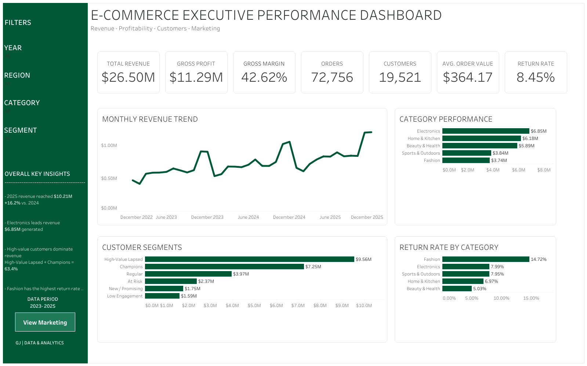
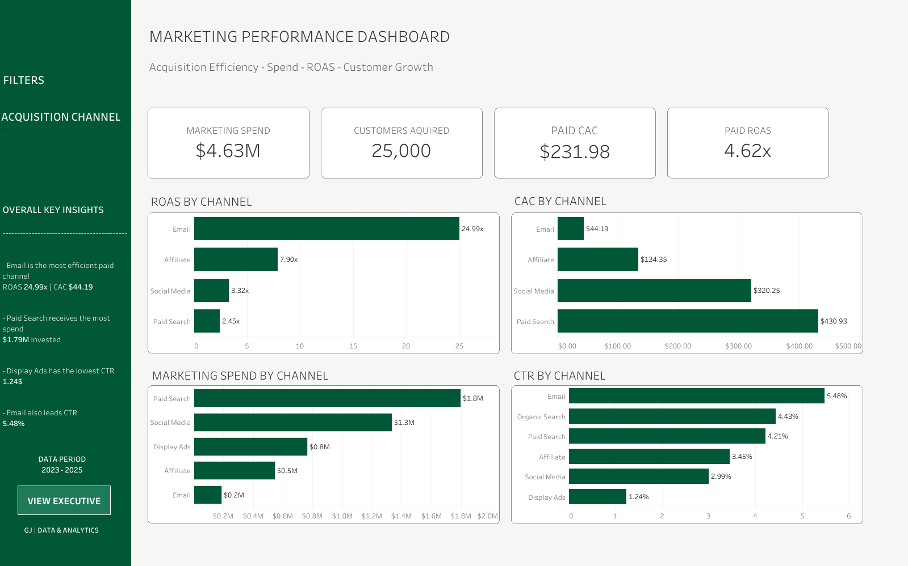

# E-Commerce Analytics | End-to-End Business Intelligence Project

End-to-end e-commerce analytics project using Python, SQL, and Tableau to analyze business performance, customer behavior, returns, and marketing efficiency.

## Live Dashboard

View the interactive Tableau Public dashboard here:

[Tableau Public – E-Commerce Analytics](https://public.tableau.com/app/profile/gonzalo.jenkins/viz/E-CommerceAnalyticsExecutiveMarketingPerformance/Dashboard1)

## Dashboard Preview

### Executive Performance Dashboard

### Marketing Performance Dashboard

## Project Overview

This project simulates a full e-commerce analytics workflow from raw data generation through executive business intelligence reporting.

The analysis covers:

- Revenue and profitability trends
- Orders, customers, and average order value
- Category and product performance
- Customer segmentation and retention
- Returns and refund impact
- Regional performance
- Marketing spend and acquisition efficiency
- CAC, ROAS, CTR, and acquisition channel performance

The dataset is synthetic and covers the period from 2023 to 2025.

## Tools & Skills

- Python
- Pandas
- SQL
- Tableau
- Data Cleaning
- Exploratory Data Analysis
- Customer Segmentation
- Marketing Analytics
- Data Visualization
- Business Intelligence

## Project Workflow

1. **Data Generation**
   - Created synthetic customers, products, orders, order items, returns, and marketing datasets.

2. **Data Quality & Cleaning**
   - Standardized categorical values
   - Handled missing values
   - Removed duplicates
   - Identified and corrected abnormal values
   - Added data quality flags

3. **Exploratory Business Analysis**
   - Revenue and profitability trends
   - Product and category performance
   - Returns analysis
   - Customer behavior
   - Regional performance
   - RFM customer segmentation
   - Marketing efficiency

4. **SQL Analysis**
   - Recreated major business findings using SQL
   - Used joins, CTEs, CASE statements, window functions, LAG(), and RANK()
   - Built reusable analytics views

5. **Dashboard Data Modeling**
   - Created BI-ready datasets for Tableau
   - Separated transaction-level and marketing-level data to avoid duplicated marketing spend

6. **Tableau Dashboard Development**
   - Built Executive Performance and Marketing Performance dashboards
   - Added interactive filters, custom tooltips, navigation, and executive insights

## Key Findings

- Total revenue reached approximately **$26.50M**
- Gross profit reached approximately **$11.29M**
- Gross margin was approximately **42.62%**
- 2025 revenue reached approximately **$10.21M**, up **16.2%** vs. 2024
- Electronics generated the highest category revenue at approximately **$6.85M**
- High-Value Lapsed and Champions represented approximately **63.4% of total revenue**
- Fashion had the highest return rate at approximately **14.72%**
- Email was the most efficient paid acquisition channel with approximately **24.99x ROAS**
- Email also had the lowest paid CAC at approximately **$44.19**
- Paid Search received the highest marketing investment at approximately **$1.79M**

## Notebooks

- `01_data_generation.ipynb`
- `02_data_quality_analysis.ipynb`
- `03_exploratory_business_analysis.ipynb`
- `04_sql_business_analysis.ipynb`
- `05_dashboard_dataset.ipynb`

## Author

**Gonzalo Jenkins**

GJ | DATA & ANALYTICS
